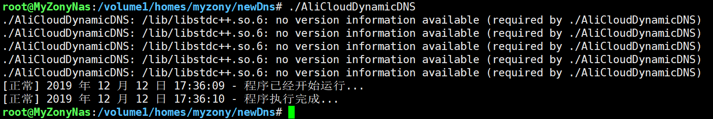
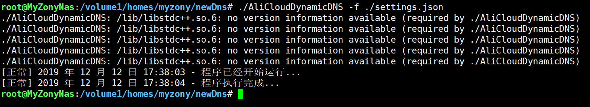
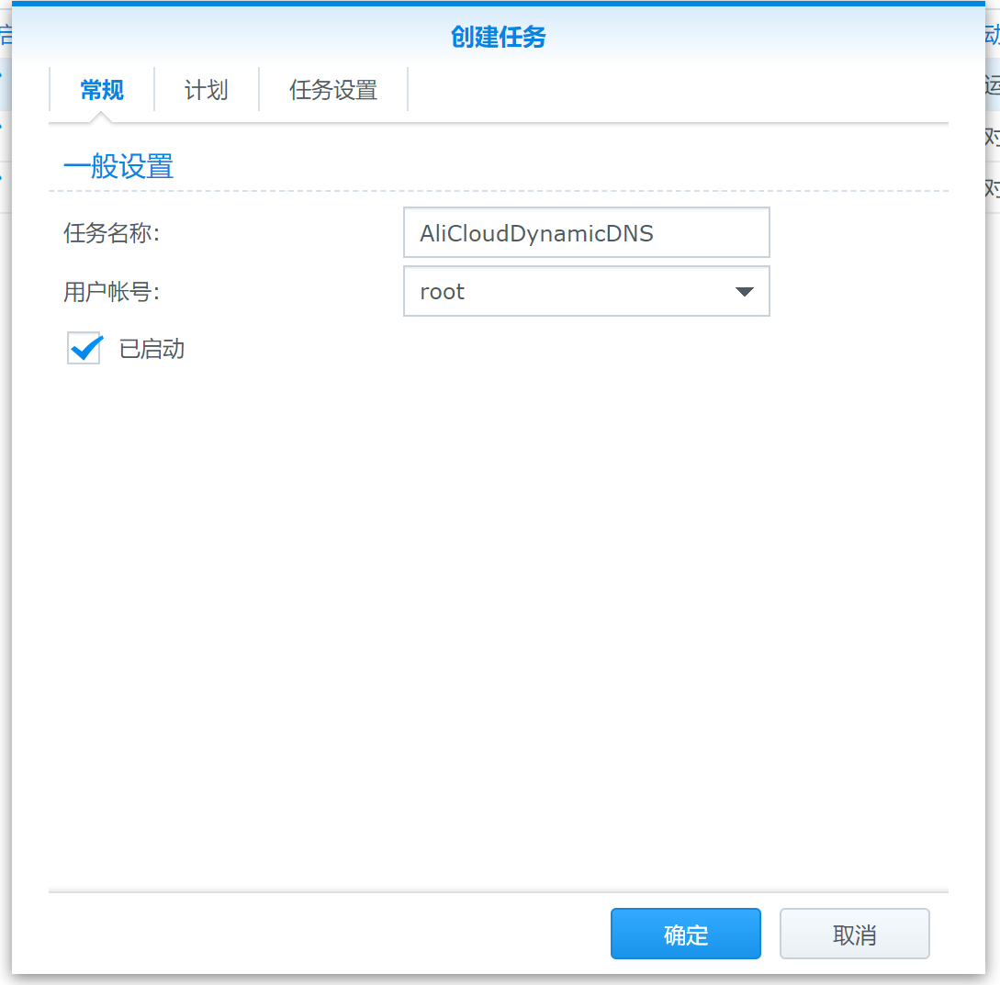
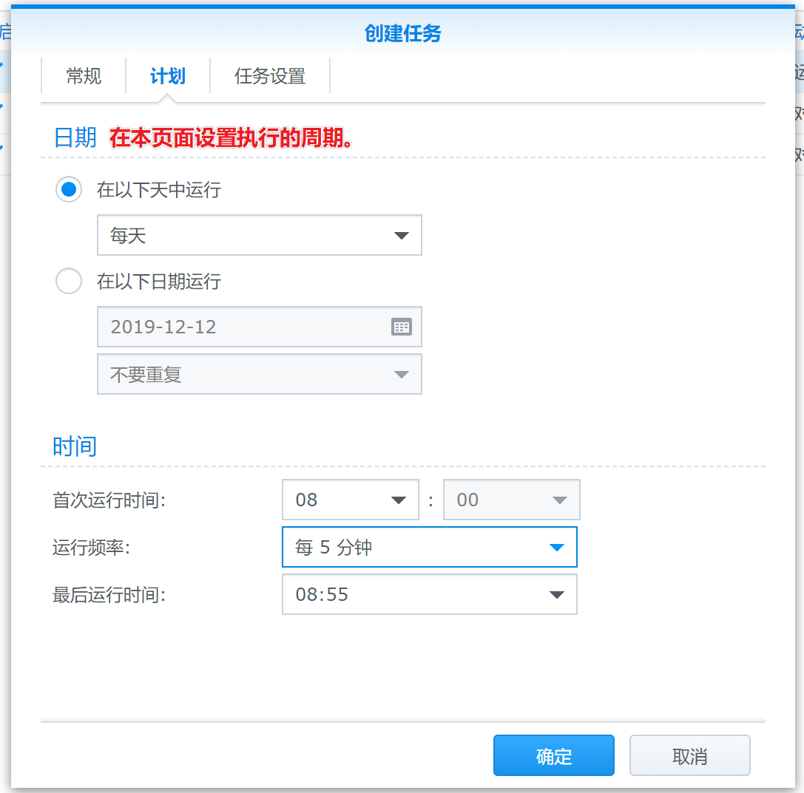
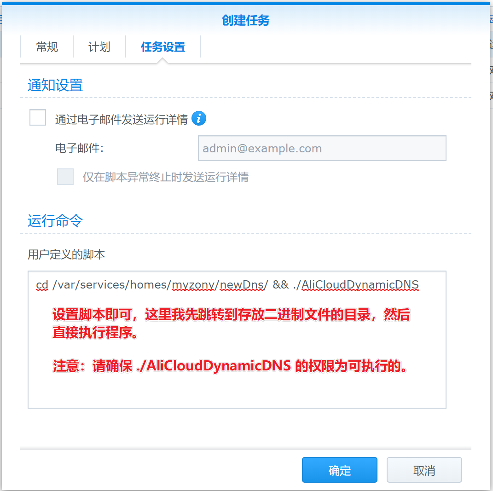

## 0.简要介绍

AliDDNSNet 是基于 .NET Core 开发的动态 DNS 解析工具，借助于阿里云的 DNS API 来实现域名与动态 IP 的绑定功能。这样你随时就可以通过域名来访问你的设备，而不需要担心 IP 变动的问题。

## 1.使用说明

> 使用本工具的时候，请详细阅读使用说明。

### 1.1 配置说明

通过更改 ```settings.json.example``` 的内容来实现 DDNS 更新，其文件内部各个选项的说明如下：

```json
{
    // 阿里云的 Access Id。
    "AccessId": "AccessId",
    // 阿里云的 Access Key。
    "AccessKey": "AccessKey",
    // 主域名。
    "MainDomain": "example.com",
    // 需要批量变更的子域名记录集合。
    "SubDomains": [
        {
            // 子域名记录类型。
            "Type": "A",
            // 子域名记录前缀。
            "SubDomain": "sub1",
            // TTL 时间。
            "Interval": 600
        },
        {
            "Type": "A",
            "SubDomain": "sub2",
            "Interval": 600
        }
    ]
}
```

其中 ```Access Id``` 与 ```Access Key``` 可以登录阿里云之后在右上角可以得到。

### 1.2 使用说明

在运行程序的时候，请建立一个新的 ```settings.json``` 文件，在里面填入配置内容，然后执行以下命令：

```shell
./AliCloudDynamicDNS
```

效果图：  


当然如果你有其他的配置文件也可以通过指定 ```-f``` 参数来制定配置文件路径。例如：

```shell
./AliCloudDynamicDNS -f ./settings.json
```



如果你需要启动自动周期检测的话，请通过 `-i` 参数指定执行周期，单位是秒。

```shell
./AliCloudDynamicDNS -f ./settings.json -i 3600
```


> **注意：**
>
> **当你通过 -i 指定了周期之后，请在最末尾使用 & 符号，使应用程序在后台运行。使用群晖的同学，就不要指定 -i 参数了。**

### 1.3 群晖 NAS 使用说明

群晖使用本工具的话推荐下载 [Release](https://github.com/GameBelial/AliDDNSNet/releases) 页面的 Linux 版本压缩包，将其通过 WinSCP 传输到群晖 NAS 上面，然后解压之后即可。

例如我这里将其解压到了 ```/var/services/homes/myzony/newDns/``` 这个目录之下，同时我们也将建立一个新的 `settings.json` 文件，并按照下方配置说明进行设置。

最后我们来到群晖的 DSM 管理面，打开 **控制面板 -> 任务计划**，添加一个新的任务，例如下图：







## 2.下载地址

程序打包了 Linux-x64 与 Linux-arm 环境的二进制可执行文件，你可以直接下载对应的压缩包解压到你的路由器或者 NAS 里面进行运行。

**[下载地址在这儿](https://github.com/GameBelial/AliDDNSNet/releases)**